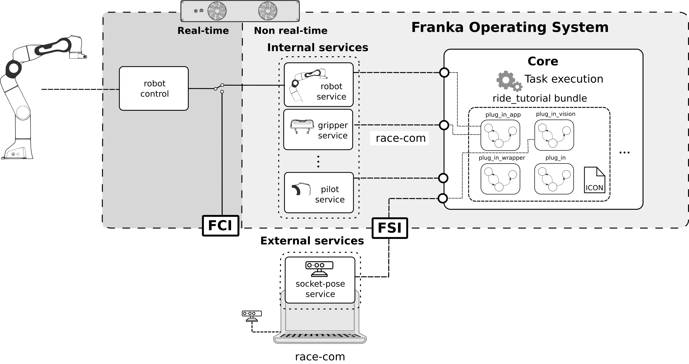

# *RIDE*
This tutorial illustrates how to program with *RIDE*, as described in the [Tutorial Paper](../README.md#tutorial-paper) in Section III-B. It consists of the implementation of the `plug_in` and `plug_in_vision` state machines, their corresponding Apps and services.

## Installation
Make sure that *RIDE* and *RaceCom* is installed in your computer, you are connected to the *Arm* base or to *Control* and logged into the *Core*:

```sh
ride login <robot-ip>
```

Create your build folder by running the following command on the root of this repository (not in the `2_RIDE` folder!):

```sh
mkdir build && cd build
```

Run cmake with the following flags in order to build the RIDE tutorials

```sh
cmake -DBUILD_RIDE=ON -DBUILD_FCI=OFF -DBUILD_LEARNING=OFF ..
```

and finally compile the *RIDE* tutorial with

```sh
make
```

To upload the state machines and Apps to the robot run

```sh
make ride_tutorial_statemachines
```

After installing the bundle the Apps should appear in the app pane. In addition to that, the bundle should appear listed after entering the following command

```sh
ride bundle list
```

Furthermore the individual state machines and Apps should be listed when you enter

```sh
ride node list
```

## Plug in App
The Plug in App is located in the `ride-tutorial` bundle in the `statemachines` directory. Every bundle consists of a `manifest.json` defining the bundle, a resource folder that stores all the icons for the context menu and a source folder, containing the state machines and App files.
The Plug in App of this tutorial is implemented in three different state machine files that can also be seen as layers:

1. *The App layer `plug_in_app.lf`:*</br>
   This state machine implements the *context menu* where the user can set required parameters in *Desk* like the socket and hole pose. It is also the 'main' execution file: after getting the context menu parameters, it runs the `plug_in_wrapper` state machine which first converts the collected parameters to state machine parameters and then performs the plug insertion.
2. *The wrapper layer `plug_in_wrapper.lf`:*</br>
   This statemachine receives the high-level parameters from the context menus and converts them to the actual parameters required for plug in and then runs the `plug_in` state machine.
3. *The execution layer `plug_in.lf`:*</br>
   This state machine implements the execution of the plug in task given by the following state flow: </br>

     1. `move_to_socket_pose` -  a cartesian motion to the socket_pose with high stiffness for high accuracy and sensitivity
     2. `set_move_configuration` - set collision thresholds and stiffness for the insertion
     3. `insert` - a *barrier* executing the following states in parallel:

         * `wiggle` - execute a wiggle motion in the (x,y) plane
         * `press` - apply and regulate a constant force along the z-axis
         * `monitor_pose` - monitor the current end-effector pose and check if the hole pose has been reached within a certain tolerance

    This implementation assumes that a plug in is successful when the robot reaches the hole pose within a certain tolerance and maximum time.

    The advantage of such a multi-layer implementation is on the one hand the reusability of individual state machines (e.g. `plug_in` and `plug_in_wrapper`) and the clarity (implementation of context menu, parameter conversion and execution are split in three different files).


#### Running the Plug in App
If you installed successfully the `ride_tutorial` the `Plug in` App will appear in the App pane of *Desk*.</br>
To run it follow the subsequent instructions:

1. Create a new Task
2. Program the task: Drag the `Plug in` App into the Timeline of the Task
3. Parameterize the task: Click on the `Plug in` App and follow the instructions to teach the robot. Note that the context menu that appear in this step are defined in the `plug_in_app.lf` file.</br>
   **Note:** The expert parameters are preconfigured and don't need to be changed. However, you can play around with them and see how the behavior of the robot changes.
4. **Optional:** Add a `Cartesian Motion` App before the `Plug in` App to allow for the experiment to be repeated. Teach the `Cartesian Motion` in a way that it unplugs the plug.
5. Activate the external activation device and click on the run button to start the task. **This will make the robot move!**

You can trace the execution in a linux terminal with

```sh
ride execution trace
```

and check the logs with

```sh
ride log
```

## Plug in App with vision
The Plug in App described above is capable of performing an insertion for a socket and hole pose taught with *Desk*. Let us assume now that a computer vision module is estimating the socket pose and we would like to use it in our `Plug in` state machine. To realize this we need: (1) a state machine executing the plug in and (2) a service providing the socket pose.
The following figure illustrates the interplay of interfaces in the system architecture and the involved bundles.



1. **Socket-pose service** </br>
The `socket-pose` service is located in `services/src/socket_service.cpp`. It implements the `getSocketPose` operation that returns the socket pose and periodically publishes the `socket-info` event with the number of sockets detected. The operation type is defined in the `GetSocketPose.op` file in `services/msg` directory. It specifies an empty operation call that returns a 16-dimensional float array in case of success and a string in case of an error. Similarly, the event type is defined in the `SocketInfo.ev` file which specifies a message given by an integer.</br>
**Note:** The socket-pose and number of sockets are hardcoded. Please adapt this to your setup.

2. **State machine** </BR>
The state machine is implemented in the `plug_in_vision.lf` file located in the `ride_tutorial` bundle. It consists of the following state flow:

    1. `check_for_sockets` - subscribes to the event `socket-info` and checks if any sockets are detected.
    2. `get_socket_pose` - calls the operation `getSocketPose` which returns the pose.
    3. `compute_hole_pose` - computes `hole_pose` from `socket_pose`
    4. `plug_in` - converts parameters and inserts the plug into the detected socket by calling `plug_in_wrapper` from above

Note that this example focuses on how to connect an external service with a state machine. All hypothetical vision related results such as the socket pose are hardcoded.


#### Running the Plug in App with vision
Before running the demo you probably want to adapt the hardcoded pose of the `socket-pose` service to your setup. To do so modify the hardcoded `socket_pose` in `services/src/socket_service.cpp` (l. 22) and compile the service again as described in the installation instructions. To adapt the socket pose to your setup, guide the robot to the desired pose and run the following command in a terminal

```sh
ride service echo robot sensor_data
```

which echoes all robot sensor data. Copy the output of the `O_T_EE` (end effector pose) and paste it in the `services/src/socket_service.cpp` file (l. 22). After recompiling as described in the installation instructions the service should be providing the new hardcoded pose.

To run the App do the following:

1. Run the service:</br>
    Open a terminal, go to the root of the repository and run

    ```sh
    ./build/2_RIDE/services/socket_service <robot-ip> 11511 <network-interface>
    ```

    with the following arguments:

    * `<robot-ip>`: is IP address of the robot (`robot.franka.de` if you  are connected to the base or your preconfigured robot ip otherwise).
    * `<network-interface>`: is the network interface used by your computer to reach the robot. You can check your network interfaces with the `ip a` command. If you are using an ethernet adapter, it will be named `enpXXXX`. Wireless adapters are denoted as `wlpXXX`. Ask your system administrator if you can't figure out your network interface.

    After running the service, it should appear listed when you enter the following command

    ```sh
    ride service list
    ```

2. Run the `plug_in_vision` state machine:</br>
    To run the `plug_in_vision` state machine first activate the external activation device, stop any execution currently running (e.g. idle state machine) by

    ```sh
    ride execution stop
    ```
    and then

    ```sh
    ride execution start plug_in_vision
    ```

    **This will make the robot move!**
