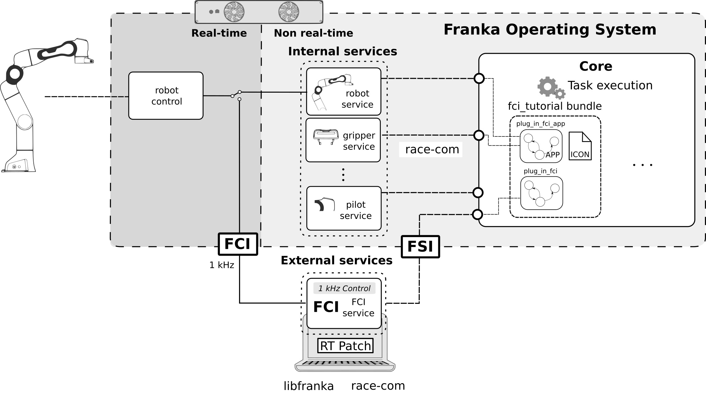

# *FCI*
This tutorial shows how to program with the *FCI* as described in the tutorial paper in Section III-C.
The *FCI* offers a 1kHz real-time transparent interface to the robot that allows to run custom controllers on an external computer running Linux with the PREEMPT RT patch.
It can either fully circumvent *Control* or rely on the internal controllers to follow joint or Cartesian space trajectories at 1 kHz specified with the motion interfaces. Specifically, the *FCI* also provides joint position, joint velocity, Cartesian pose and Cartesian velocity interfaces. *libfranka*, the open source C++ library for the client-side of the interface, provides also access to all sensor measurements and the robot model library, which includes the kinematic and Lagrangian dynamic model parameters. This tutorial will show how to implement a standalone custom controller and then how to embed this custom controller into an App.

**Note:** For more information about the *FCI* check out its [documentation](https://frankaemika.github.io/docs/index.html).

## Installation
Make sure that libfranka, *RIDE* and *RaceCom* are installed on your computer. To install libfranka follow these [instructions](https://frankaemika.github.io/docs/installation_linux.html). To install the necessary state machines for the *RIDE* integration, make sure that you are connected to *Control* (The *FCI* will not work if you are connected to the *Arm* base!) and logged into the *Core*:

```sh
ride login <robot-ip>
```

Create your build folder by running the following command on the root of the repository (not in the `3_FCI` folder!):

```sh
mkdir build && cd build
```

Run cmake with the following flags in order to build the *FCI* tutorial

```sh
cmake -DBUILD_RIDE=OFF -DBUILD_FCI=ON -DBUILD_LEARNING=OFF -DCMAKE_BUILD_TYPE=Release -DFranka_DIR=<path/to/libfranka/build/folder> ..
```

and finally compile the *FCI* tutorial with

```sh
make
```

To compile the state machines and Apps and upload them to your robot run

```sh
make fci_tutorial_statemachines
```

After installing the bundle the `Plug In FCI` App should appear in the app pane. Note that the App is grey shaded as long as the `fci_service` is not running.

## Standalone
To program a plug in task with the *FCI* we implement a Cartesian impedance controller with an additional term that regulates the desired contact force. For details on the mathematical background, please check the [Tutorial Paper](#tutorial-paper). The controller is implemented in `plug_in_controller.cpp/.h` as a reusable function which is used in `plug_in_controller_standalone.cpp` to run the controller. The controller finishes when the `hole_pose` is reached within an certain tolerance and time. Otherwise it throws an `franka_exception` which stop the robot control. For more information on the controller have look at the paper in Section III-C.

#### Running the custom plug in controller

To run any *FCI* controller first make sure that your PC is running a real-time kernel and that it's connected to *Control*.</br>

**Warning:** Make sure that end effector is in contact with a horizontal surface before running this code. The controller regulates the contact force along the z-axis of the robot's end-effector and if no object is holding it, the robot will move down!

To run the plug in controller go to the root directory of the repository, activate the external activation device and run

```sh
./build/3_FCI/standalone/plug_in_controller_standalone <robot-ip>
```

**Note:** You can change the control parameters in `plug_in_controller_standalone.cpp` and observe its impact to the behavior of the robot. Make sure you rebuild the plug in controller every time you make a change. The parameters are described in the header `plug_in_controller.h`.

## *RIDE* integration
An *FCI* program can be also integrated into a state machine or an App. To do so we will need (1) an external *RIDE* service with an operation that runs the *FCI* controller and (2) a state machine that calls the operation. The following figure illustrates the interplay of interfaces in the system architecture and the involved bundles.



You can find the corresponding files in the `ride_integration` directory.

1. ***FCI* service:**
   The implementation of the *RaceCom* service `fci` is located in `services/src/fci_service.cpp`. It has an operation `plugIn` that runs the *FCI* plug in controller described in the standalone section of this tutorial. The operation is defined in the `services/msg/PlugIn.op` file. It specifies an operation that accepts the plug in controller parameters and returns nothing in case of success and a string including the error message in case of any errors.

2. **State machine:**
    The state machines are very similar to the plug in state machines of the `ride_tutorial` bundle. It also follows the same multi-layered implementation, but in this case the wrapper layer is not necessary because we have to convert less parameters from the context menu. Specifically, the `fci_tutorial` bundle located in the `statemachines/bundles` folder consists of the following state machines:

    1. *The App layer `plug_in_fci_app.lf`:* </br>
      This state machine implements the *context menu* and handles all parameters such as the socket pose, the hole pose and the plug in controller parameters. It then performs the plug in by calling the `plug_in_fci` statemachine.

    2. *The execution layer `plug_in_fci.lf`:*</br>
      This statemachine executes the plug in. It's the same code as in the `plug_in` state machine of the `ride_tutorial` bundle, but instead of the `insert` state, the operation `plugIn` of the `fci` service is called to run the controller.


### Running the Plug in *FCI* App
If you successfully installed the `fci_tutorial` bundle you should see the `Plug In FCI` App (most probably grey shaded) in the App area of *Desk*. </br>
Make sure you are connected to *Control* and do the following:

1. Run the `fci` service: </br>
    Open a terminal, go to the root of the repository and run

    ```sh
    ./build/3_FCI/ride_integration/services/fci_service <robot-ip> 11511 <network-interface>
    ```

    with the following arguments:

    * `<robot-ip>`: is IP address of the robot (Your preconfigured shopfloor IP).
    * `<network-interface>`: is the network interface used by your computer to reach the robot. You can check your network interfaces with the `ip a` command. If you are using an ethernet adapter, it will be named `enpXXXX`. Wireless adapters are denoted as `wlpXXX`. Ask your system administrator if you can't figure out your network interface.

   If everything went well, the service should be available and will appear listed when you enter the following command

   ```sh
   ride cli services
   ```

   In addition, the `Plug In FCI` App should now appear colored in Desk. The reason for that is that, for each App, Desk checks if the services that it requires are connected to the robot. If a service is missing, the App will appear grey shaded and will not be executable. In our example, after connecting the `fci` service the App should fulfill all requirements and should appear colored.

2. Run the `Plug In FCI` App in Desk:

    1. Create a new Task

    2. *Program the task:* Drag the `Plug In FCI` App into the Timeline of the Task

    3. *Parameterize the task:* Click on the `Plug In FCI` App and follow the instruction to teach the robot.</br>
    **Note:** The expert parameters are preconfigured and needn't to be changed. Anyway you can play around with them and observe how the behavior of the robot changes.

    4. **Optional:** Add a `Cartesian Motion` App before the `Plug in FCI` App to allow for the experiment to be repeated. Teach the `Cartesian Motion` in a way that it unplugs the plug.

    5. Activate the external activation device and click on the run button to start the task. **This will finally make the robot move!**
