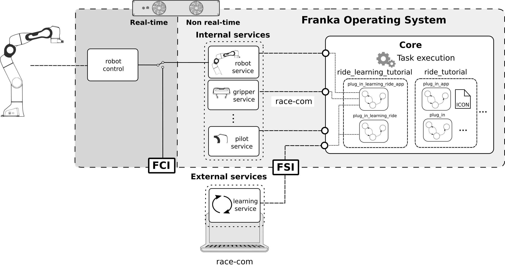
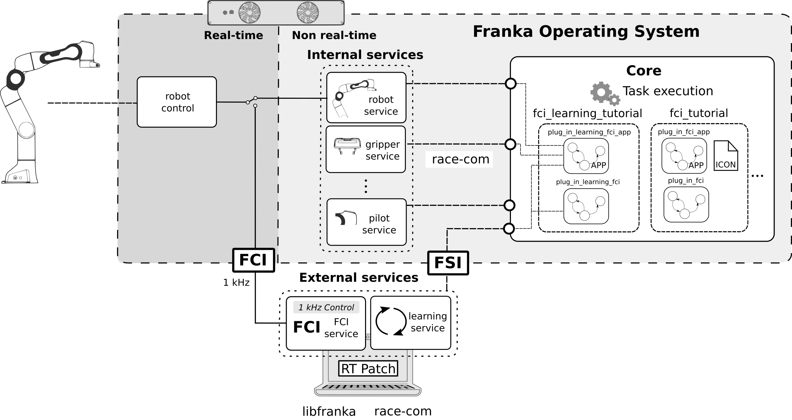

# Learning
This tutorial shows how to apply *on robot* learning with the Franka Emika AIR Platform as described in the tutorial paper in Section IV.

For both the `plug_in` ([RIDE tutorial](../2_RIDE)) and `plug_in_fci` ([FCI tutorial](../3_FCI)) examples, we implement a procedure that explores and optimizes the control parameters that succeed and at the same time minimize the interaction forces.

## Installation

Make sure that libfranka, *RIDE* and *RaceCom* are installed on your computer. To install libfranka follow these [instructions](https://frankaemika.github.io/docs/installation_linux.html). To install the necessary state machines for the *RIDE* integration, make sure that you are connected to *Control* (The *FCI* will not work if you are connected to the *Arm* base!) and logged into the *Core*:

```sh
ride login <robot-ip>
```

The learning tutorial depends on services, state machines and controllers from the *RIDE* and *FCI* tutorials.
To build all of them, run in the repository root (not in the `4_Learning` folder!):

```sh
mkdir build && cd build
```

Run cmake with the following flags in order to build the learning tutorial

```sh
cmake -DBUILD_RIDE=ON -DBUILD_FCI=ON -DBUILD_LEARNING=ON -DCMAKE_BUILD_TYPE=Release -DFranka_Dir=<path/to/libfranka/build/folder> ..
```

and compile with

```sh
make
```

To compile all state machines and Apps and upload them to your robot run

```
make ride_tutorial_statemachines &&
make fci_tutorial_statemachines &&
make learning_tutorial_statemachines
```

After installing the bundles the Apps should appear in the app pane. Note that the Apps are grey shaded as long as the `fci` and the `learning` service are not running.

## Learning service
Regardless of the method used, e.g. reinforcement learning or stochastic optimization, all *on robot* learning methods follow the same underlying operational loop where a learning service generate parameters that are then tested and evaluated on the robot. The result is used by the learning service to generate the next parameter set and this procedure is iterated until convergence.

The implementation of the `learning` service is located in `services/src/learning_service.cpp`.
In our prototypical implementation, the `learning` service provides the following 4 operations:

* `init` initializes the learning algorithm. This operation is defined by the `Init.op` and receives the hyperparameters of the learning algorithm.
* `getParams` computes and returns the parameters for the next experimental trial. This operation is defined in the `GetParam.op` file.
* `setResult` receives the cost function value and a boolean representing the insertion success. This operation forwards the result to the learning algorithm. In addition, the operation returns a boolean indicating if the learning process has finished/converged. This operation is defined in the `SetResult.op` file.
* `getBestParams` returns the best set of parameters that has been experienced so far by the learning algorithm. More precisely, the best parameters are the ones that led to a successful execution task and also minimize the interaction forces. This operation is defined by the `GetBestParams.op` file.

#### Learning algorithm
This tutorial provides the skeleton for the implementation of on robot learning approaches. For the sake of simplicity, the learning algorithm implemented is *random search*, which *randomly* selects parameters, tests and evaluates them.</br>
It is implemented as a C++ class that is located in the `service` directory. The methods of this class are used in the `learning` service to implement the operations. The `learning` service is implemented in such a way that it can learn any state machine or App as it interacts with the state machine through an array of doubles, i.e. it searches for the optimal array of parameters with no prior knowledge at all.
Adapting the implementation to a more capable algorithm should be straightforward.

## Plug in learning
This examples shows how to learn the parameters of a state machine, in this case the `plug_in` state machine of the `ride_tutorial` bundle.
The learning loop is implemented in a state machine. The state machine uses the `learning` service for learning and `RIDE` to test and evaluate parameters on the robot.
The following figure illustrates the interplay of interfaces in the system architecture and the involved bundles.



Specifically, the `ride_learning_tutorial` bundle located in the `statemachine/source` directory is composed by the following state machines:

* *The App layer `plug_in_learning_ride_app.lf`:* </br>
  This state machine implements the *context_menu*, gathers all required parameters from *Desk* and runs the App. It consists of the following two states:

   1. `learn_or_run`: This state evaluates a boolean that indicates if the user wants to learn or just run the plug in statemachine. The user can toggle this variable in the context menu.

   2. Depending on the selected mode in the previous step, it will:

       a)  **Learning:**
            Run the `plug_in_learning_ride` state machine explained below. </br>

       b) **Execution:**
            Run the following two states:

          1. `get_best_params`: This state requests the `getBestParams` operation to get best previously learned parameters currently stored in the `learning` service.

          2. `plug_in`: This runs the `plug_in_wrapper` state machine from the `ride_tutorial` bundle with the acquired parameters.

* *The learning layer: `plug_in_learning_ride.lf`:*
  This state machine implements the learning loop, given by the following states:

    1. `init`: The first state initializes the learning algorithm with the hyperparameters using the `init` operation of the `learning` service.
    2. *Learning loop:* The following states will be sequentially executed

       1. `reset`: This state resets the robot and its environment. It moves the robot to a home pose and clears all errors.
       2. `get_params`: This state request the `getParams` operation for getting the parameters for the next experimental trial.
       3. `explore`: This state runs the plug in App with the parameters from the `get_params` state. It executes the `plug_in_wrapper` state machine of the `ride_tutorial` bundle using these parameters and at the same time the robot state is observed to compute the cost function (here the interaction forces are cumulated).
       4. `set_result`: Regardless of the outcome of the `plug_in_wrapper` state machine, this state returns the result of the cost function and an boolean representing the insertion success by calling the `setResult` operation of the `learning` service. Depending on the operation's response it also decides if the learning should continue or not. If it continues, the state machine jumps to the `reset` state and executes another iteration of the learning loop. Otherwise the learning is done and the state machine finishes with success.

#### Running the Plug in learning App
If you successfully installed the `ride_learning_tutorial` bundle you should see the `Plug In Learning` App (most probably grey shaded) in the app area of Desk. To

1. Run the `learning` service: </br>
    Open a terminal and go to the root of the repository and run

    ```sh
    ./build/4_Learning/services/learning_service <robot-ip> 11511 <network-interface>
    ```

    with the following arguments:

    * `<robot-ip>`: is the IP address of the robot (`robot.franka.de` if you are connected to the *Arm* base or your preconfigured robot ip otherwise).
    * `<network-interface>`: is the network interface used by your computer to reach the robot. You can check your network interfaces with the `ip a` command. If you are using an ethernet adapter, it will be named `enpXXXX`. Wireless adapters are denoted as `wlpXXX`. Ask your system administrator if you can't figure out your network interface.

    After running the service, it should appear listed when you enter the following command

    ```sh
    ride cli services
    ```

   In addition, the `Plug In Learning` App should now be colored in Desk.

2. Run the `Plug In Learning` App in Desk:

   1. Create new Task
   2. *Program the task:* Drag the `Plug In Learning` App into the Timeline of the Task
   3. *Parameterize the task:* Click on the `Plug In Learning` App and follow the instruction to teach the robot.
   4. Learn the task:

      1. Go to the *Mode* tab and move the slider to *Learning*. Then set the
       Hyperparameter of the learning algorithm. </br>
       **Note:** The Hyperparameters are already configured. The only thing you should change is the number of iterations. For a short demo, 10 iterations are a good start.
      2.  Activate the external activation device and click on the run button.
   5. Run the learned task: </br>
      1. Go to the *Mode* tab and move the slider to *Execution*.
      2. Activate the external activation device and click on the run button.

## Plug in *FCI* learning

In this example we will learn the parameters of a custom FCI controller. It is the same code used in the previous subsection, but instead of exploring the `plug_in_wrapper` state machine of the `ride_tutorial` bundle, the `plug_in_learning_fci` explores the  `plug_in_fci` state machine of the `fci_tutorial` bundle. The implementation of this example is collected in the `fci_learning_tutorial` bundle which is located in the `statemachines/source` folder.


#### Running the Plug in *FCI* learning App
If you successfully installed the `fci_learning_tutorial` bundle you should see the `Plug In FCI Learning` App (most probably grey shaded) in the app area of Desk. </br>

1. Run the `learning` service as explained in the [*Running the Plug in learning App* subsection](#Running-the-Plug-in-learning-App).
2. Run the `fci` service: </br>
   From your repository root, run:

   ```sh
   ./build/3_FCI/ride_integration/services/fci_service <robot-ip> 11511 <network-interface>
   ```

   Now the services are available and you should be able to see them when you enter the following command

   ```sh
   ride cli services
   ```

   In addition to that, the `Plug In FCI Learning` App should now be colored in Desk.

3. Run the `Plug In FCI Learning` App in Desk. It operates the same way as the `Plug In Learning` App described in the [*Running the Plug in learning App* subsection](#Running-the-Plug-in-learning-App)
