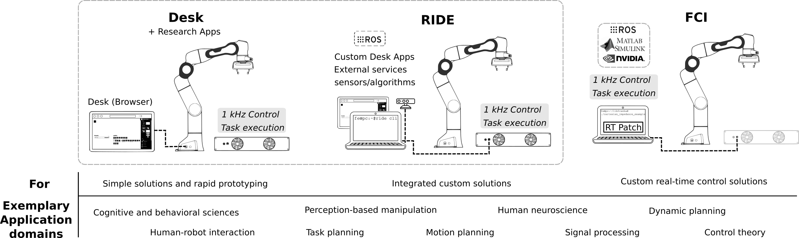
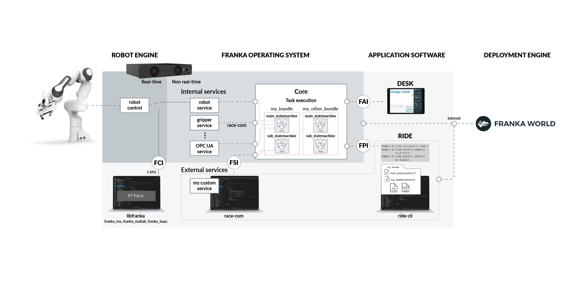

# A Tutorial on the Reference Platform for AI and Robotics (AIR) from Franka Emika

The Franka Emika Panda Series is the first series of industrial AI-enabled tactile robot platforms. Beyond industrial use, the systems can be seamlessly expanded to fulfill the demands of *research and education* across all robotics and AI disciplines.

In this repository you will find the accompanying code of the Reference Platform Paper. If this code helps you in your research, please cite.

In addition, the researchers at Munich School of Robotics and Machine Learning (MSRM) have prepared a series of comprehensive tutorial videos which can be found [here](https://www.youtube.com/playlist?list=PLeVqiD9lLCrlxLJI3Eibi-je2fNqwt1am).

## Three programming interfaces

The AIR Platfrom provides three different programming interfaces:

* **Desk**, a high level App-based user interface for easy and fast task programming. *Desk*, together with the Research Apps is conceptualized to be the right interface for high-level programs, such as human-robot interaction studies or for rapid prototyping quick ideas.
* **RIDE**, a command-based programming environment to create high performance robot skills that enables programming custom Apps and integrating external sensors. *RIDE* is the most suitable programming interface for research that does not require per-millisecond reactions, such as task and path planning or perception-based manipulation.
* The **FCI**, a 1 kHz low-level torque and position control interface that exploits the also available Lagrangian dynamic robot model. It is the right
interface to explore new low-level planning and control schemes.

#### System Architecture

Before getting started, get familiar with the system architecture shown in the following figure:

The *Franka Operating System* running on Franka Emika robots has the following main components:

* *State machines*, which are the basic units of execution in the system. They call operations from services, execute scripts, and may contain other state machines. All Apps as seen in *Desk* are state machines. They are grouped together into *bundles*, which also store related resources such as icons. State machines are programmed in a domain-specific language called *Lingua Franka* and stored in .lf files.

* *Services* are nodes which run on *Control* (internal services) or any external computer (external services). They communicate with the core via the *race-com* library and can provide operations and publish events periodically. The most relevant service is the *robot service*, which provides all operations to command the robot such as move or applyForce.

* The *Core* orchestrates the execution of state machines, stores installed bundles and ensures that newly uploaded bundles are consistent with existing ones. It also implements three system interfaces:
    * The *Franka Application Interface* (FAI), the interface used by *Desk* to command and monitor the system.
    * The *Franka Professional Interface* (FPI), the interface used by *ride-cli* to manipulate, run and install state machines and Apps in the system.
    * The *Franka Service Interface* (FSI), the interface used by the *race-com* library to connect external services to the system.

The *Application Software* represent the access point for users. There are currently two clients in the system:

* *Desk*, which can start the execution of timelines~(which are sequences of state machines) and trigger other specific functionalities such as opening the brakes or turning the power on or off.
* *ride-cli*, the main App development tool, which provides a command-line interface to start, compile, install, monitor and debug the execution of state machines.

Note that the *FCI*, the low-level 1 kHz interface to the robot bypasses the Franka Operating System and represents a direct UDP-based connection to the real-time robot control.

## The tutorial
This tutorial showcases the wide range of programming possibilities that the Franka Emika's AIR Platform offers. We strongly recommend to read first the *Reference Platform Paper* before continuing. The tutorial is divided in 4 lessons and built around a plug in task, solved with all three programming interfaces:

* The [first lesson](1_Desk/), [`1_Desk`](1_Desk/), shows how to quickly prototype the plug in task in *Desk* and how to start tasks from the web interface or the command line tool.
* The [second lesson](2_RIDE/), [`2_RIDE`](2_RIDE/), implements a custom and more capable plug in App with *RIDE*. It then adds an external service simulating the integration of a camera and incorporates it into the App.
* The [third lesson](3_FCI/), [`3_FCI`](3_FCI/), implements a custom plug in controller as a Cartesian impedance controller with an additional term regulating the contact force. It then integrates this custom controller into an App.
* The [fourth lesson](4_Learning/), [`4_Learning`](4_Learning/), implements an on robot learning algorithm that learns the optimal control parameters for the custom App and the custom controller presented in the second and third lesson respectively.

## RIDE CLI
The following table lists some helpful commands that might be used during the tutorial.

| Command                                | Description                                 |
|----------------------------------------|---------------------------------------------|
| `ride login <robot_ip>`                | Connect to the core.                        |
| `ride bundle list`                     | List installed bundles.                     |
| `ride node list`                       | List root nodes (installed state machines). |
| `ride service list`                    | List connected services.                    |
| `ride execution start <state machine>` | Start execution of a state machine.         |
| `ride execution stop`                  | Stop execution gracefully.                  |
| `ride log`                             | Display the log message feed from the core. |
| `ride service echo <service> <event>`  | Print service events relayed by the core.   |
| `ride execution trace`                 | Trace execution of a state machine.         |

## Requirements

* Ubuntu with PREEMP_RT patch according to [Minimum System and Network Requirements](https://frankaemika.github.io/docs/requirements.html)
* minumum cmake version: cmake >= 3.5
* Robot System version 4.X
* RIDE version 3.X
* RaceCom version 14.X
* libfranka version 0.8.X

## Tutorial paper

**The Franka Emika Robot: A Reference Platform for Robotics Research and Education** paper is located [here](https://ieeexplore.ieee.org/document/9721535).

## License

`the_reference_platform` is licensed under the [Apache 2.0 license][apache-2.0].

[apache-2.0]: https://www.apache.org/licenses/LICENSE-2.0.html
